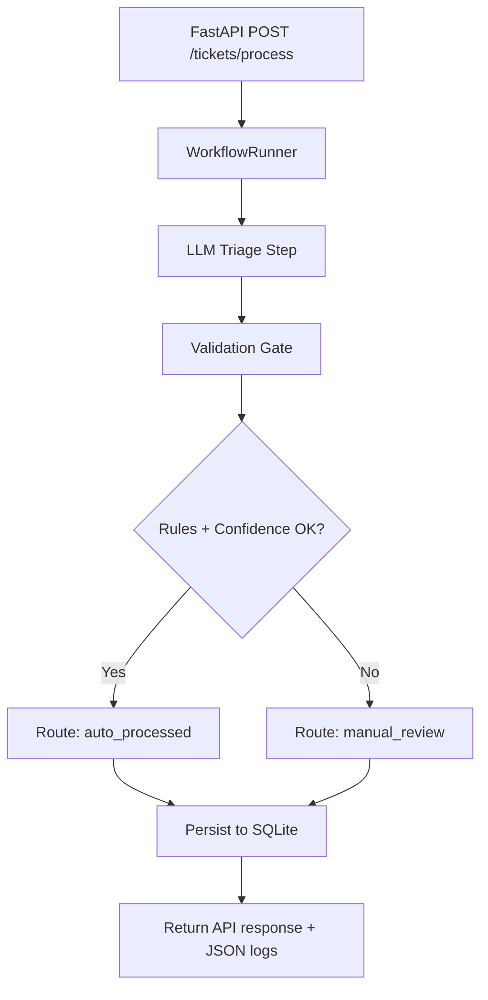

# digital-postcard-agentic-pipeline

A small, runnable agentic + deterministic support triage pipeline for a digital postcard startup.

## What this project does
- Accepts support tickets through FastAPI (`POST /api/v1/tickets/process`).
- Runs a purposeful LLM triage step to:
  - classify category
  - estimate urgency + confidence
  - extract useful fields
  - draft a customer support reply
- Applies deterministic controls (schema and rule checks).
- Routes tickets to `auto_processed` or `manual_review` (fail-closed).
- Saves outcomes to SQLite and emits structured JSON logs.

## Why this workflow
Support triage is high-volume and repetitive. Automating first-pass classification + response drafting reduces manual load while deterministic gates keep reliability and safety high.

## Setup
1. Create and activate a virtual environment.
2. Install dependencies.
3. Copy `.env.example` to `.env`.
4. Run the API.

```bash
python -m venv .venv
# Windows PowerShell
.\.venv\Scripts\Activate.ps1
pip install -r requirements.txt
Copy-Item .env.example .env
uvicorn app.main:app --reload
```

## Environment Variables
- `APP_NAME`: app title.
- `APP_ENV`: environment name.
- `API_V1_PREFIX`: API prefix (default `/api/v1`).
- `DATABASE_URL`: SQLite URL (default `sqlite:///./support_tickets.db`).
- `LLM_MODE`: `mock` or `openai`.
- `OPENAI_API_KEY`: required only when `LLM_MODE=openai`.
- `OPENAI_MODEL`: model name for OpenAI mode.
- `CONFIDENCE_THRESHOLD`: routing threshold (default `0.75`).
- `LLM_TIMEOUT_SECONDS`: timeout for provider calls.

## Run Locally
```bash
uvicorn app.main:app --reload
```

Health check:
```bash
curl http://127.0.0.1:8000/api/v1/tickets/health
```

## Test with curl
```bash
curl -X POST "http://127.0.0.1:8000/api/v1/tickets/process" \
  -H "Content-Type: application/json" \
  -d @sample_requests/ticket_refund.json
```

Inline example:
```bash
curl -X POST "http://127.0.0.1:8000/api/v1/tickets/process" \
  -H "Content-Type: application/json" \
  -d "{\"customer_email\":\"pat@example.com\",\"subject\":\"Payment problem\",\"message\":\"I was charged twice for order ORD-11\",\"order_id\":\"ORD-11\"}"
```

## Run Tests
```bash
pytest -q
```

## Project Structure
```text
app/
  api/routes.py
  core/config.py
  db/database.py
  db/models.py
  models/schemas.py
  services/llm_service.py
  services/workflow_runner.py
  services/steps/
    base.py
    llm_triage.py
    validate.py
    route.py
    persist.py
  utils/logging.py
  main.py
tests/
  test_happy_path.py
  test_manual_review.py
sample_requests/
  ticket_refund.json
requirements.txt
.env.example
README.md
writeup.md
```

## Architecture Overview


## Failure Handling
- LLM call retries once for transient failures.
- If retry still fails, workflow routes to `manual_review`.
- Strict Pydantic schema parsing rejects malformed LLM outputs.
- Guardrails enforce allowed categories, confidence range/threshold, and required `order_id` for transactional categories.
- System fails closed: any violation => `manual_review`.

## Reusability (System That Builds Systems)
The workflow is built as a runner with modular steps. To add a second workflow quickly, compose a new step list and expose a new route while reusing shared context, logging, persistence, and LLM service interfaces.
